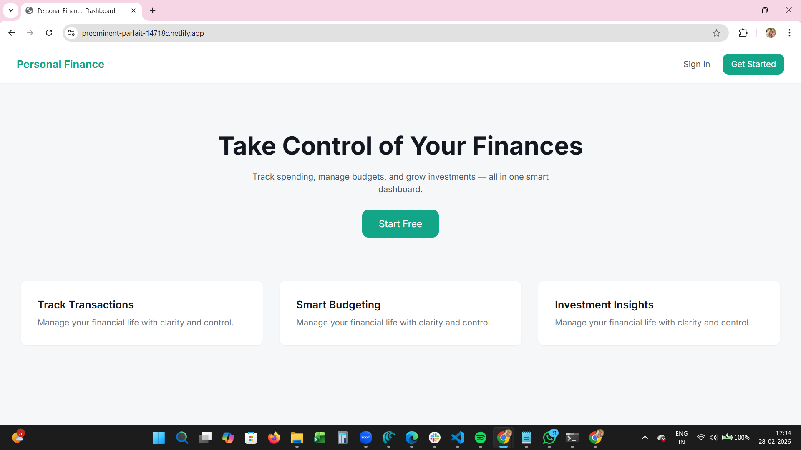
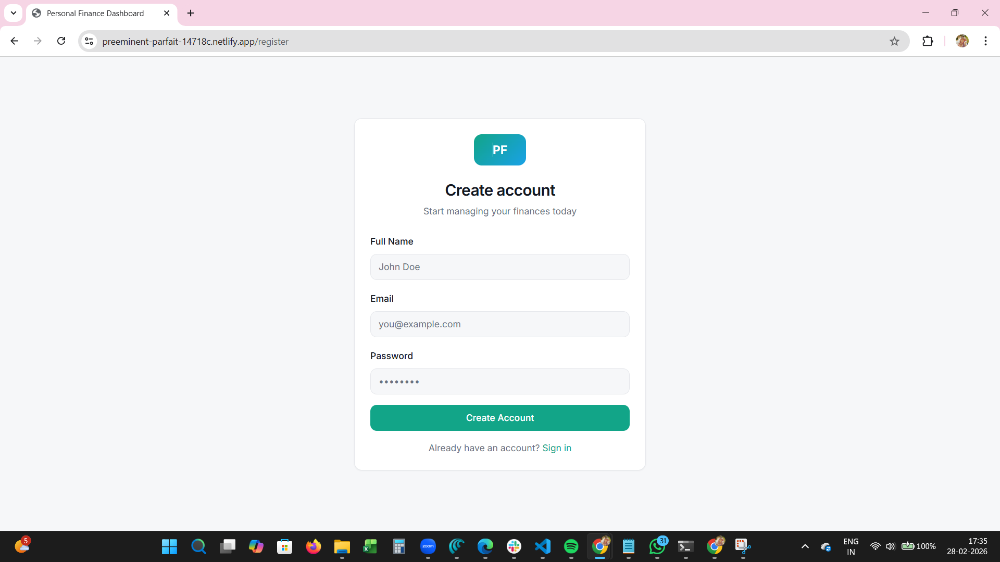
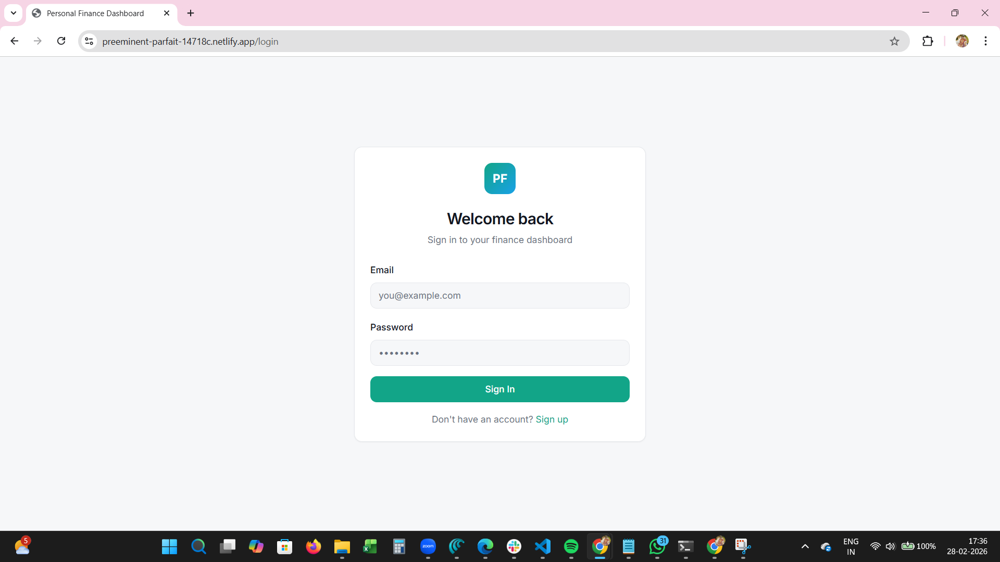
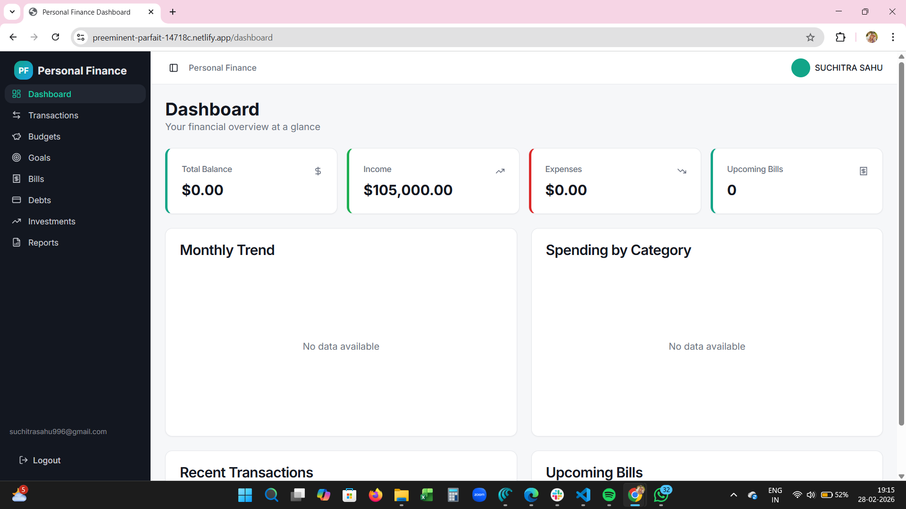
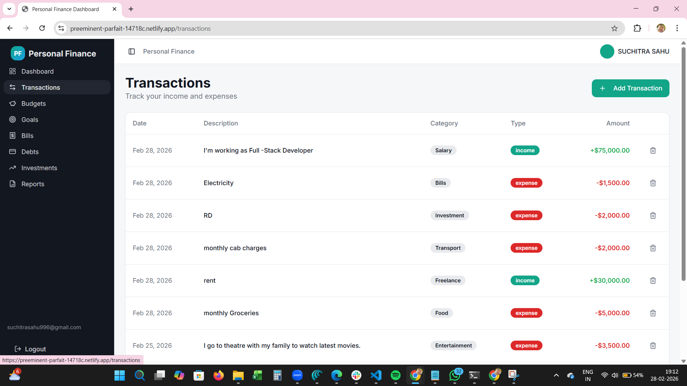
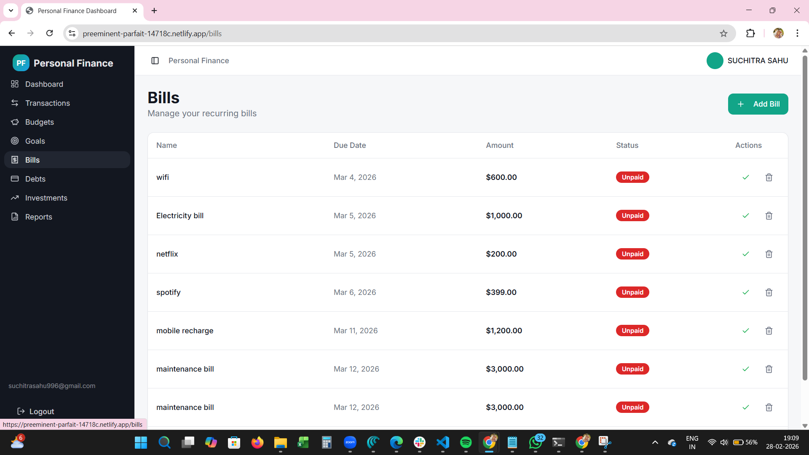
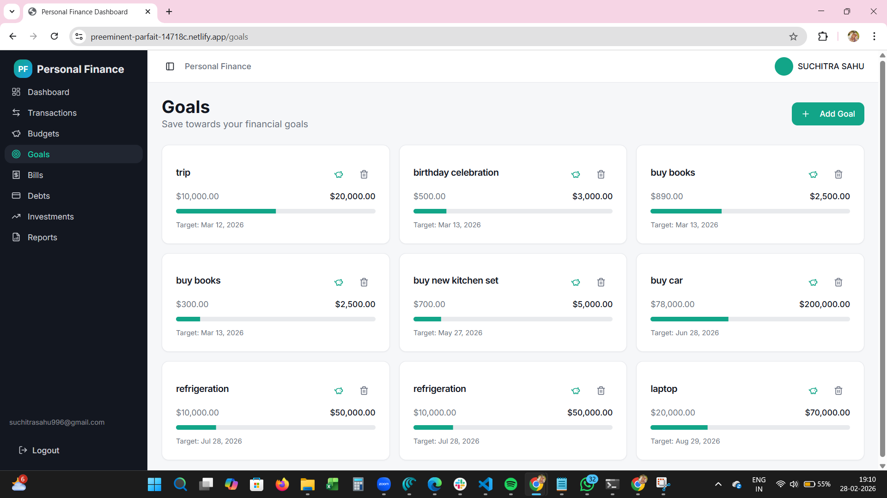
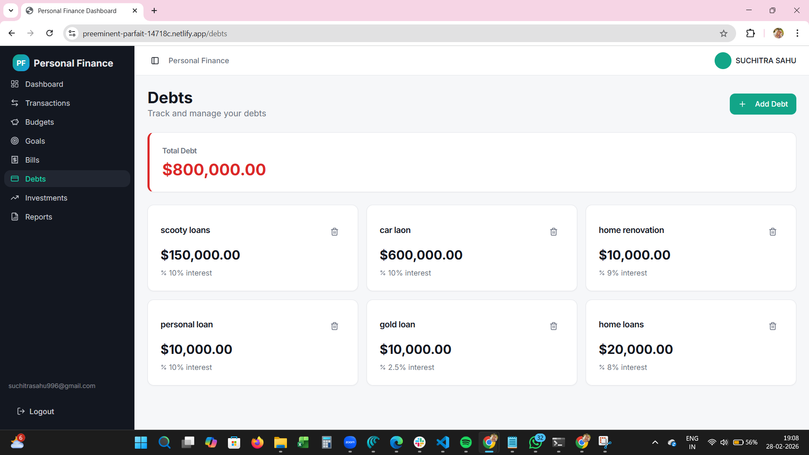
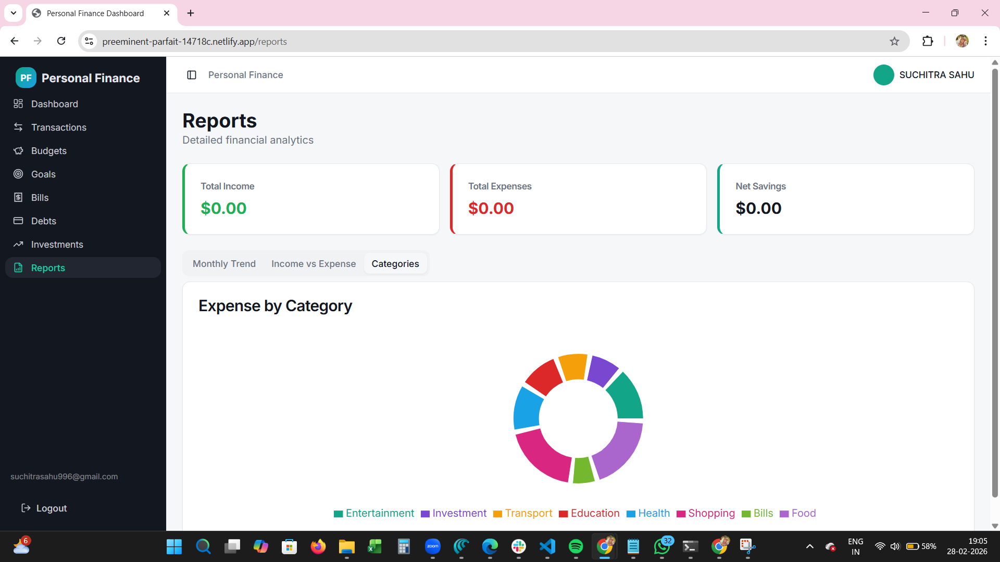

## Personal Finance Dashboard

## Project Description 
Personal Finance Dashboard is full-stack web application designed to help users to help users track, manage and analyze their financial activies in one centralized platform .This application enables users to monitor income, expenses,budgets,investments,debts,and financial goals through interactive dashboard and analytics visualisations.The system provides secure authentication ,real-time finanical insights, and structured financial planning tools to support better decision-making.

## Features

## Authenication
* User registration & Login
* JWT- based authenication
* Protected Routes
* Persistent Login 

## Finincial Management 
* Transaction tracking (income & expenses )
* Budget creation and monitoring 
* Bill management and mointoring 
* Bill management 
* Debt Tracking 
* Investment Tracking 
* Finanical goal managment 

## Analytics and Visualization
* Responsive dashboard layout 
* Sidebar Navigation 
* Toast notifications 
* Modern UI components
* Routes protection

## Tech Stack Used
 ## Frontend
 * React(Vite + TypeScript)
 * Tailwind CSS
 * ShadCn UI
 * Axios 
 * React Router
 * Context API(State Management)
 * Recharts (Charts & Analytics)

 ## Backend
 * Node.js
 * Express.js
 * JWT Authentication 
 * REST API Architecture

 ## Database 
 * Subapase 

 ## Deployment
 * Frontend : Netlify
 * Backend : Render

 ## Installation Steps

1. Clone Repository
</> Bash :-
git clone https://github.com/suchitrasahu996-creator/frontend-repo.git
cd frontend-repo

2. Install Dependencies
</> Bash:- npm install 

3. Environment  Variables
create a .env.local file:- VITE_API_URL=http://localhost:5000

4. Run Development Server
 </> Bash :- npm run dev
 App run at :-http://localhost:8080

 ## Deployment Link 

 $$ Live Application:-https://preeminent-parfait-14718c.netlify.app

 ** Backend API Link
 $$ BAckend API :-https://backend11-vtze.onrender.com

 ## Login Credentials (Demo)
 Email: demo@example.com
Password: password123

## SCREENSHOTS

## Landing page (first page)

## Signup

 
 ## Login Page
 

## Dashboard 

## Transaction Page

## Budget page

## Bills page

## Goals page

## Debts page

## Investment page

## Reports page

### Video Walkthrough
👉 

## Future Improvements

* AI-based expense insights

* Recurring transaction automation

* Export financial reports (PDF/CSV)

* Mobile app version

* Multi-currency support

## Author

## Suchitra Sahu

* GitHub: https://github.com/suchitrasahu996-creator

* LinkedIn: https://linkedin.com/in/suchitra-sahu-721266194/

## Project Structure (Frontend)
└── 📁src
    └── 📁components
        └── 📁charts
            ├── CategoryPieChart.tsx
            ├── IncomeExpenseBarChart.tsx
            ├── MonthlyTrendChart.tsx
        └── 📁layout
            ├── AppLayout.tsx
            ├── AppSideBar.tsx
            ├── ProtectedRoute.tsx
        └── 📁ui
            ├── accordion.tsx
            ├── alert-dialog.tsx
            ├── alert.tsx
            ├── aspect-ratio.tsx
            ├── avatar.tsx
            ├── badge.tsx
            ├── breadcrumb.tsx
            ├── button.tsx
            ├── calendar.tsx
            ├── card.tsx
            ├── carousel.tsx
            ├── chart.tsx
            ├── checkbox.tsx
            ├── collapsible.tsx
            ├── command.tsx
            ├── context-menu.tsx
            ├── dialog.tsx
            ├── drawer.tsx
            ├── dropdown-menu.tsx
            ├── form.tsx
            ├── hover-card.tsx
            ├── input-otp.tsx
            ├── input.tsx
            ├── label.tsx
            ├── menubar.tsx
            ├── navigation-menu.tsx
            ├── pagination.tsx
            ├── popover.tsx
            ├── progress.tsx
            ├── radio-group.tsx
            ├── resizable.tsx
            ├── scroll-area.tsx
            ├── select.tsx
            ├── separator.tsx
            ├── sheet.tsx
            ├── sidebar.tsx
            ├── skeleton.tsx
            ├── slider.tsx
            ├── sonner.tsx
            ├── switch.tsx
            ├── table.tsx
            ├── tabs.tsx
            ├── textarea.tsx
            ├── toast.tsx
            ├── toaster.tsx
            ├── toggle-group.tsx
            ├── toggle.tsx
            ├── tooltip.tsx
            ├── use-toast.tsx
        ├── NavLink.tsx
    └── 📁context
        ├── AuthContext.tsx
        ├── FinanceContext.tsx
    └── 📁hooks
        ├── use-mobile.tsx
        ├── use-toast.ts
    └── 📁lib
        ├── utils.ts
    └── 📁pages
        ├── Bills.tsx
        ├── Budgets.tsx
        ├── Dashboard.tsx
        ├── Debts.tsx
        ├── Goals.tsx
        ├── Index.tsx
        ├── Investments.tsx
        ├── Landing.tsx
        ├── Login.tsx
        ├── NotFound.tsx
        ├── Register.tsx
        ├── Reports.tsx
        ├── Transactions.tsx
    └── 📁services
        ├── analyticsService.ts
        ├── api.ts
        ├── authService.ts
        ├── billService.ts
        ├── budgetService.ts
        ├── debtService.ts
        ├── goalService.ts
        ├── investmentService.ts
        ├── transactionService.ts
    └── 📁test
        ├── example.test.ts
        ├── setup.ts
    └── 📁utils
        ├── formatters.ts
    ├── App.css
    ├── App.tsx
    ├── index.css
    ├── main.tsx
    └── vite-env.d.ts

